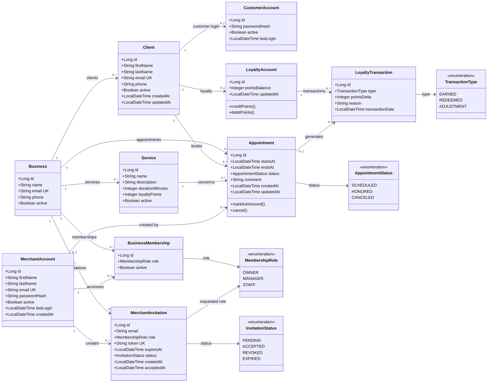

# Modele de domaine ShopWise

Ce diagramme represente les entites JPA actuellement implementees. Les donnees
metier sont isolees par `Business`. Un `MerchantAccount` accede a un ou plusieurs
commerces par l'intermediaire de `BusinessMembership`.

## Contraintes metier representees

- Un rattachement `(merchantAccount, business)` est unique.
- Les roles d'un rattachement sont `OWNER`, `MANAGER` ou `STAFF`.
- Une entreprise doit conserver au moins un `OWNER` actif.
- Une invitation possede un jeton unique, une expiration et un statut de cycle de vie.
- Un client, une prestation, un rendez-vous et le compte de fidelite associe appartiennent a un seul commerce.
- Le createur d'un rendez-vous est le `MerchantAccount` de la session, pas l'ancienne entite `Merchant`.
- Un client peut avoir au maximum un `CustomerAccount` et un `LoyaltyAccount`.
- Un rendez-vous peut generer au maximum une `LoyaltyTransaction`.
- Chaque nouveau commerce recoit les trois prestations par defaut configurees par le backend.
